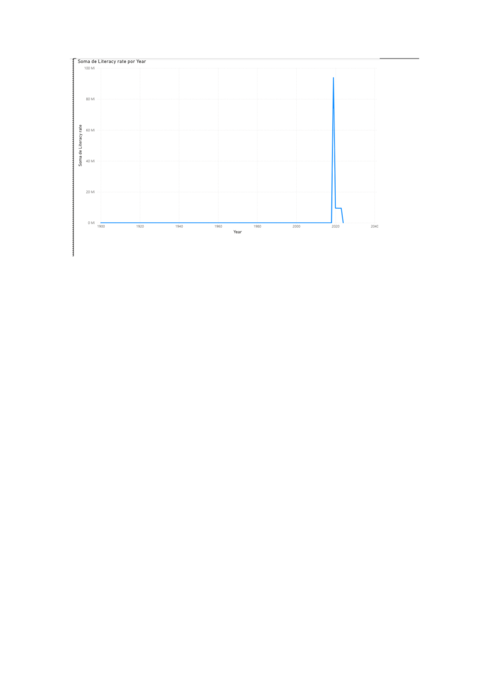

# 
Brazil Literacy Rate Analysis. A Power BI project visualizing the historical evolution of literacy in Brazil using Our World in Data (UNESCO/IBGE). Shows steady growth and data trends over recent decades, built as part of my data science portfolio for Irish university applications.
